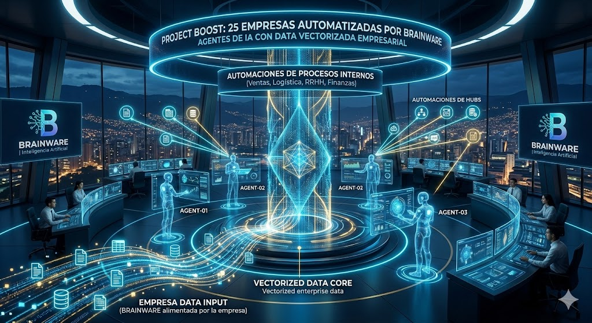

# Portafolio Brainware + Mainics

Software y Automatización

## **1. Proyecto Boost: Inteligencia Artificial Vectorizada y Automatización a Gran Escala**

**El Desafío:**
Implementar soluciones de alta tecnología para **25 empresas**, transformando su operatividad dispersa en un ecosistema de eficiencia inteligente y automatizada.

**La Solución de Brainware:**
En el marco del **Proyecto Boost**, desarrollamos una arquitectura de vanguardia basada en **Agentes de IA de alto rendimiento**. El núcleo de esta solución reside en el despliegue de **bases de datos vectorizadas** personalizadas, alimentadas directamente con la data propietaria de cada empresa.

Esta infraestructura permitió que los agentes no solo procesaran información, sino que "comprendieran" el contexto específico de cada negocio de manera segura y precisa. Sobre esta base de inteligencia robusta, **Brainware** ejecutó diversas **automatizaciones de procesos internos** (ventas, logística, RRHH y finanzas), eliminando cuellos de botella y liberando recursos críticos.

**Impacto y Resultados:**

- **Escalabilidad Real:** Implementación exitosa en 25 organizaciones simultáneamente.
- **Precisión de Data:** Consultas inteligentes basadas exclusivamente en información empresarial verificada.
- **Eficiencia Operativa:** Reducción drástica en tiempos de ejecución mediante flujos de trabajo autónomos.

Con el Proyecto Boost, **Brainware** reafirma su capacidad para entregar soluciones de IA que no solo son innovadoras, sino que están profundamente integradas en el éxito operativo de nuestros clientes.

## **2. Econova: Eco-Aventura – Gamificación Educativa para Librero Cobre**

**El Desafío:**
Traducir los procesos industriales y el compromiso ambiental de la empresa **Librero Cobre** en una experiencia digital atractiva y comprensible para niños y jóvenes de sus zonas de influencia. El objetivo era transformar la educación corporativa en una aventura interactiva.

**La Solución de Brainware:**
Desarrollamos **Econova**, un videojuego de mundo abierto con estética *pixel art* que sumerge a los jugadores en un entorno de gestión y exploración. A través de mecánicas de juego intuitivas, los usuarios aprenden sobre la cadena de valor de la empresa, el cuidado de los recursos naturales y el impacto positivo en la comunidad.

**Características Técnicas y Creativas:**

- **Narrativa Educativa:** Misiones diseñadas para enseñar sobre sostenibilidad y procesos minero-industriales de forma lúdica.
- **Interfaz de Usuario (UI) Adaptativa:** Menús claros y sistemas de progresión (como la "Ecotienda") que incentivan el aprendizaje continuo.
- **Mecánicas de Gestión:** Los jugadores recolectan recursos y gestionan infraestructuras, entendiendo el equilibrio entre producción y preservación ambiental.
- **Identidad Visual Propia:** Creación de un universo visual completo, desde el diseño de personajes hasta el logotipo del proyecto, alineado con los valores de **Librero Cobre**.

**Impacto:**
Econova no es solo un juego; es una herramienta pedagógica que permite a la empresa conectar con las nuevas generaciones, facilitando la comprensión de su labor diaria y fomentando una cultura de responsabilidad ambiental en el territorio.

## **3. Ascrudos: Ecosistema Digital para la Gestión de Residuos y Atención al Cliente**

**El Desafío:**
Optimizar la interacción con los clientes y la gestión logística de **Ascrudos**, una empresa líder en "Generación Verde". El objetivo era centralizar la atención al público y automatizar procesos críticos como la recolección de residuos peligrosos y la emisión de documentos legales.

**La Solución de Brainware:**
Desarrollamos una plataforma integral que combina un **CRM robusto** con un **Chatbot de Atención Inteligente**, diseñado específicamente para las necesidades de la industria de residuos:

- **Chatbot Omnicanal:** Automatización de la atención al público, resolviendo dudas frecuentes y guiando a los usuarios en tiempo real.
- **Gestión de PQRs y Certificados:** Sistema automatizado para la generación de certificados legales y el seguimiento de Peticiones, Quejas y Reclamos (PQRs), garantizando trazabilidad total.
- **Logística de Residuos Peligrosos:** Módulo especializado para la gestión interna de recolecciones, coordinando de manera eficiente el manejo de materiales críticos bajo normativas ambientales.
- **CRM de Gestión Interna:** Un panel centralizado para el equipo de Ascrudos que permite visualizar el ciclo de vida del cliente y el estado de cada servicio operativo.

**Impacto y Valor:**
Con esta implementación, **Brainware** logró reducir los tiempos de respuesta de **Ascrudos**, eliminar errores manuales en la emisión de certificados y fortalecer su compromiso con la sostenibilidad mediante una logística digitalizada y eficiente.

## **3. Ascrudos: Motor de Automatización Masiva de Certificaciones Ambientales**

**El Desafío:**
Gestionar manualmente la emisión y el envío de documentos legales para una operación de gran escala. **Ascrudos** necesitaba una solución que eliminara el cuello de botella administrativo en la generación de certificados de disposición de residuos y reportes de huella de carbono, procesos que consumían horas de trabajo humano.

**La Solución de Brainware:**
Diseñamos un **Motor de Generación y Envío Masivo** de alto rendimiento, integrado directamente con la base de datos logística de la empresa. Esta solución técnica permite:

- **Escalabilidad Extrema:** Generación automatizada de **más de 1,000 certificados diarios** sin intervención humana.
- **Procesamiento de Alta Velocidad:** Reducción del tiempo de ciclo a solo **5 minutos** para el procesamiento completo de lotes masivos.
- **Distribución Automatizada:** Sistema de envío programado que entrega los documentos directamente a los correos electrónicos de los clientes finales una vez validada la recolección.
- **Cálculo de Huella de Carbono:** Algoritmo integrado que procesa los datos de recolección para generar reportes precisos sobre el impacto ambiental y la mitigación de emisiones.

**Impacto en el Negocio:**
Con esta implementación de **Brainware**, **Ascrudos** logró una digitalización del 100% en sus entregables legales, garantizando una respuesta inmediata a sus clientes y permitiendo que el equipo administrativo se enfoque en tareas de mayor valor estratégico.

## **4. BeautyConnect: Ecosistema Digital 360° para la Industria de la Belleza**

**El Desafío:**
Cerrar la brecha digital entre los salones de belleza y sus clientes, eliminando las barreras de agendamiento y potenciando el networking dentro del sector. El objetivo era crear una solución integral que gestionara desde la primera impresión del cliente hasta la operatividad interna del negocio.

**La Solución de Brainware:**
Desarrollamos una arquitectura de tres pilares diseñada para maximizar la conversión y la eficiencia operativa:

- **Experiencia Móvil (App para Clientes):** Una aplicación intuitiva para iOS y Android donde los usuarios pueden descubrir salones por ubicación, servicios o valoraciones, realizando agendamientos en tiempo real con confirmación inmediata.
- **Gestión Profesional (Web App para Negocios):** Una potente herramienta administrativa para los establecimientos. Permite la gestión dinámica de horarios, control total de la agenda, base de datos de clientes y análisis de desempeño del salón.
- **Presencia Digital (Landing Page de Alto Impacto):** Un sitio web optimizado para la captación de nuevos socios comerciales, exponiendo las ventajas competitivas del sistema y facilitando el *onboarding* de nuevos centros de belleza.

**Impacto y Valor:**
Con **BeautyConnect**, **Brainware** entrega una solución que no solo automatiza la agenda, sino que profesionaliza la data del negocio, permitiendo a los dueños de salones tomar decisiones basadas en información real mientras ofrecen una experiencia de usuario moderna y sin fricciones.

link: [https://beautyapp.mainics.com/](https://beautyapp.mainics.com/)

## **5. LeadQuality: Calificación Inteligente de Leads con IA en Tiempo Real**

**El Desafío:**
Las empresas invierten grandes presupuestos en campañas de Meta Ads y WhatsApp, pero sus equipos de ventas suelen perder hasta el 70% de su tiempo contactando "leads fríos" o datos falsos. El reto era crear una herramienta que centralizara el caos multicanal y priorizara automáticamente a los prospectos con verdadera intención de compra.

**La Solución de Brainware:**
Desarrollamos **LeadQuality**, un ecosistema SaaS potenciado por Inteligencia Artificial que actúa como el filtro definitivo para equipos comerciales. La plataforma no solo centraliza los contactos, sino que los audita basándose en el contexto del *buyer persona* de cada negocio:

- **IA Scoring Basado en Lenguaje Natural:** Nuestra IA analiza la información del prospecto y le asigna un puntaje de calidad (0-100%) en segundos, permitiendo que el vendedor se enfoque solo en los cierres de alto valor.
- **Centralización Multicanal:** Integración nativa con Meta Ads (Facebook/Instagram), formularios web y WhatsApp, eliminando la dispersión de datos en hojas de cálculo.
- **Atribución y ROI Real:** Dashboard avanzado que permite rastrear exactamente qué campaña o anuncio generó la venta final, optimizando la inversión en marketing.
- **Automatización de Contacto:** Envío automático del lead calificado directamente al WhatsApp del vendedor asignado para acortar los tiempos de respuesta.
- **Prompts Editables:** Permite a los negocios entrenar a la IA con sus propias reglas de negocio y preguntas específicas de su industria.

**Impacto y Resultados:LeadQuality** transforma el proceso de ventas de reactivo a proactivo. Al eliminar el ruido de los leads de baja calidad, las empresas que utilizan esta tecnología de **Brainware** reportan una mejora significativa en su ROI, mayor organización interna y un incremento directo en su tasa de cierre de ventas.

link: [https://leadquality.app/](https://leadquality.app/)

